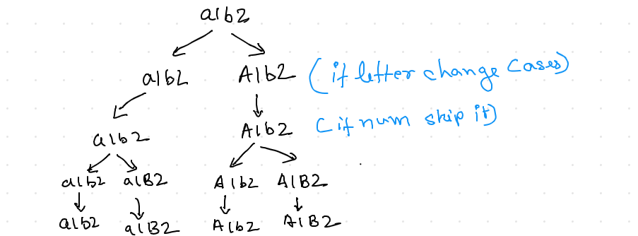

#  Backtracking

---
## Approach:

1. Choice
1. Constraints
1. Goal

## 784. Letter Case Permutation

Given a string S, we can transform every letter individually to be lowercase or uppercase to create another string.  Return a list of all possible strings we could create.

```
Examples:
Input: S = "a1b2"
Output: ["a1b2", "a1B2", "A1b2", "A1B2"]

Input: S = "3z4"
Output: ["3z4", "3Z4"]

Input: S = "12345"
Output: ["12345"]
```

## Solution



```cpp
class Solution {
public:
    vector<string> letterCasePermutation(string S) {
        vector<string> res;
    
        backtrace(S,0,res);
        return res;
        
    }
    
    void backtrace(string &S, int i,vector<string> &res){
        if( i == S.length() ) {
            res.push_back( S );
            return; 
        } 
        if( 'a' <= S[i] && S[i] <= 'z' ) { // two branches if a letter
            backtrace( S, i + 1, res );
            S[i] = 'A' + S[i] - 'a';
            backtrace( S, i + 1, res );
        } else if ( 'A' <= S[i] && S[i] <= 'Z' ) { // two branch if a letter 
            backtrace( S, i + 1, res );
            S[i] = 'a' + S[i] - 'A';
            backtrace( S, i + 1, res );
        } else { // one branch if a digit
            backtrace( S, i + 1, res );
        }
        
    }
    
    
};

```

## 17. Letter Combinations of a Phone Number

Given a string containing digits from 2-9 inclusive, return all possible letter combinations that the number could represent.

A mapping of digit to letters (just like on the telephone buttons) is given below. Note that 1 does not map to any letters.

```
 Example:

Input: "23"
Output: ["ad", "ae", "af", "bd", "be", "bf", "cd", "ce", "cf"].
```

## Solution


```cpp
class Solution {
public:
    
vector<string> letterCombinations(string digits) {
        if (digits.empty()) return {};
        
        unordered_map<char, string> num_to_char {{'2', "abc"}, {'3', "def"}, {'4', "ghi"}, {'5', "jkl"}, {'6', "mno"}, {'7', "pqrs"}, {'8', "tuv"}, {'9', "wxyz"}};
        
        vector<string> result; 
        string combination(digits.length(), ' ');
        letterCombinations(digits, combination, 0, num_to_char, result);
        
        return result;
    }
    
    void letterCombinations(string digits, string& combination, int idx,  unordered_map<char, string>& num_to_char, vector<string>& result)
    {
        if (idx == digits.length()){
            result.push_back(combination);
            return;
        }
        
        for (char c : num_to_char[digits[idx]]){
            combination[idx] = c;
            letterCombinations(digits, combination, idx + 1, num_to_char, result);
        }
    }
};

```


## 22. Generate Parentheses


Given n pairs of parentheses, write a function to generate all combinations of well-formed parentheses.

```
For example, given n = 3, a solution set is:

[
  "((()))",
  "(()())",
  "(())()",
  "()(())",
  "()()()"
]

```

## Solution


```cpp
class Solution {
public:
    
vector<string> generateParenthesis(int n) {
        vector<string> result;


        // open and close indicates number of open parentheses
        // and number of close parentheses respectively
        backTrack(0,0,"",result,n);
        return result;
    }
    
    void backTrack(int open, int close,string cur_str,vector<string> &result,int &mx){
        
        if(cur_str.length() == 2* mx){
            result.push_back(cur_str);
            return;
        }


        // if number of open parentheses is less than required append a open parentheses 
        // and backtrack
        if(open < mx) backTrack(open+1,close,cur_str+"(",result,mx);
        // if number of close parathese is less than open parentheses (since they must
        // be in same quantity) then append a close parentheses and backtrack
        if(close <open) backTrack(open,close+1,cur_str+")",result,mx);
        
    }
};

```


## 46. Permutations

Given a collection of distinct integers, return all possible permutations.
```
Example:

Input: [1,2,3]
Output:
[
  [1,2,3],
  [1,3,2],
  [2,1,3],
  [2,3,1],
  [3,1,2],
  [3,2,1]
]
```

## Solution


```cpp
class Solution {
public:
  vector<vector<int>> permute(vector<int>& nums) {
            
        vector<vector<int>> result;
        
        vector<int> cur_perm(nums.size(),0);
        
        unordered_set<int> visited;
        backtrack(0,cur_perm,visited,nums,result);
        return result;
    }
    
    
    void backtrack(int idx,vector<int> &cur_perm,unordered_set<int> &visited,vector<int> nums,vector<vector<int>> &result){
        // the base case
        if(idx == cur_perm.size()){
            result.push_back(cur_perm);
            return;
        }
        
        // 1. choices 
        // we can chose any number from the given list
        for(auto x:nums){
            
            // only if the number was previously not used
            if (visited.find(x) == visited.end() ) {
                    // mark the number as visited
                    visited.insert(x);   
                
                    cur_perm[idx] = x;       
                    backtrack(idx+1,cur_perm,visited,nums,result);
                    // unmark as visited 
                    visited.erase(x);
                
            }
            
        }
        
    }
};

```

## 47. Permutations II

Given a collection of numbers that might contain duplicates, return all possible unique permutations.

```
Example:

Input: [1,1,2]
Output:
[
  [1,1,2],
  [1,2,1],
  [2,1,1]
]
```

## Approach


1. We will sort the array

1. After we return from recursion we skip the duplicates with a while loop

## Solution

```cpp
class Solution {
public:
    vector<vector<int>> permuteUnique(vector<int>& nums) {
        vector<vector<int>> result;
        vector<int> cur_perm(nums.size(),0);
        
        sort(nums.begin(),nums.end());
        
        unordered_set<int> visited;
        backtrack(0,cur_perm,visited,nums,result);
        return result;
    }
    
    void backtrack(int idx,vector<int> &cur_perm,unordered_set<int> &visited,vector<int> nums,vector<vector<int>> &result){
        if(idx == nums.size()){
            result.push_back(cur_perm);
            return;
        }
        
        for(int i = 0;i<nums.size();i++){
            
            if(visited.find(i)==visited.end()){
                
                visited.insert(i);
                cur_perm[idx] = nums[i];
                backtrack(idx+1,cur_perm,visited,nums,result);
                visited.erase(i);
                
                while( (i < nums.size() -1) && nums[i+1] == nums[i]){
                    i++;
                }
            }
            
            
        }
        
    }
};
```

## 39. Combination Sum
Given a set of candidate numbers (candidates) (without duplicates) and a target number (target), find all unique combinations in candidates where the candidate numbers sums to target.

The same repeated number may be chosen from candidates unlimited number of times.

Note:

All numbers (including target) will be positive integers.
The solution set must not contain duplicate combinations.
```
Example 1:

Input: candidates = [2,3,6,7], target = 7,
A solution set is:
[
  [7],
  [2,2,3]
]
Example 2:

Input: candidates = [2,3,5], target = 8,
A solution set is:
[
  [2,2,2,2],
  [2,3,3],
  [3,5]
]
```

## Solution

```cpp
class Solution {
public:
    vector<vector<int>> combinationSum(vector<int>& candidates, int target) {
        vector<vector<int>> result;
        vector<int>  cur_combination;
        backtracking(0,cur_combination,candidates,target, 
                     result); 
        return result;
    }
    
    void backtracking(int idx,vector<int> &cur_combination,vector<int> &candidates,int target,vector<vector<int>> &result){
        if(target == 0){
            result.push_back(cur_combination);
            return;
        }
        
        // to remove duplicate we start from the next possible number
        // because we already have used the earlier numbers
        for (int i = idx; i < candidates.size();++i){
            if(target - candidates[i] >=0 ){
                cur_combination.push_back(candidates[i]);
                
                // i is passed not i+1 because i can be used multiple times to form the 
                // sum 
                backtracking(i,cur_combination,candidates,target-candidates[i],result);
                cur_combination.pop_back();
            }
            
                
        }
        
    }
};


```

## 40. Combination Sum II

Given a collection of candidate numbers (candidates) and a target number (target), find all unique combinations in candidates where the candidate numbers sums to target.

Each number in candidates may only be used once in the combination.

**Note:**

All numbers (including target) will be positive integers.
The solution set must not contain duplicate combinations.

```
Example 1:

Input: candidates = [10,1,2,7,6,1,5], target = 8,
A solution set is:
[
  [1, 7],
  [1, 2, 5],
  [2, 6],
  [1, 1, 6]
]
Example 2:

Input: candidates = [2,5,2,1,2], target = 5,
A solution set is:
[
  [1,2,2],
  [5]
]
```

## Aporach


1. Firstly we will sort the candidates.

1. To not include the duplicates we will skip the numbers  
after we return from the recursion using a while loop!.


## Solution

```cpp
class Solution {
public:
    vector<vector<int>> combinationSum2(vector<int>& candidates, int target) {
        vector<vector<int>> result;
        
        sort(candidates.begin(),candidates.end());
        
        vector<int>  cur_combination;
        backtracking(0,cur_combination,candidates,target,
                     result); 
        return result;
    }
    
    void backtracking(int idx,vector<int> &cur_combination,vector<int> &candidates,int target,vector<vector<int>> &result){
        if(target == 0){
            result.push_back(cur_combination);
            return;
        }
        
        //Start from the next remaining p candidates.
        for (int i = idx; i < candidates.size();++i){
            if(target- candidates[i] >= 0){
                cur_combination.push_back(candidates[i]);
                backtracking(i+1,cur_combination,candidates,target-candidates[i],result);
                cur_combination.pop_back(); 
                while( (i < candidates.size() -1) && candidates[i+1] == candidates[i]){
                    i++;
                }
                
            }
                
        }
        
    }
};

```

## 78. Subsets

Given a set of distinct integers, nums, return all possible subsets (the power set).

Note: The solution set must not contain duplicate subsets.
```
Example:

Input: nums = [1,2,3]
Output:
[
  [3],
  [1],
  [2],
  [1,2,3],
  [1,3],
  [2,3],
  [1,2],
  []
]
```

## Solution 

```cpp
class Solution {
public:
    vector<vector<int>> subsets(vector<int>& nums) {
        vector<vector<int>> result;
        
        backtrack(0,{},result,nums);
        return result;
    }
    
    void backtrack(int idx, vector<int> cur_set,vector<vector<int>> &result, vector<int> &nums){
        
        result.push_back(cur_set);
        
        for(int i = idx;i<nums.size();i++){
            
            cur_set.push_back(nums[i]);
            backtrack(i+1,cur_set,result,nums);
            cur_set.pop_back();
               
        }
        
    }
};

```

## 77. Combinations

Given two integers n and k, return all possible combinations of k numbers out of 1 ... n.
```
Example:

Input: n = 4, k = 2
Output:
[
  [2,4],
  [3,4],
  [2,3],
  [1,2],
  [1,3],
  [1,4],
]
```

## Solution

```cpp
class Solution {
public:
    vector<vector<int>> combine(int n, int k) {
        vector<vector<int>> result;
        
        vector<int> cur_combination(k,0);
        backtracking(1,0,cur_combination,result,n,k);
        return result;
    }
    void backtracking(int idx,int sz,vector<int> &cur_combination,vector<vector<int>> &result,int n,int k){
        if(sz == k){
            result.push_back(cur_combination);
            return;
        }
        for(int i = idx;i<=n;i++){
            
            for(int j = sz;j<k;j++){
                if( j>0 && cur_combination[j-1] ==0 ) continue;
                cur_combination[j] = i;
                backtracking(i+1,j+1,cur_combination,result,n,k);  
                cur_combination[j] = 0;
            }
            
        }
    }
};


```

## 90. Subsets II

Given a collection of integers that might contain duplicates, nums, return all possible subsets (the power set).

Note: The solution set must not contain duplicate subsets.

```
Example:

Input: [1,2,2]
Output:
[
  [2],
  [1],
  [1,2,2],
  [2,2],
  [1,2],
  []
]
```

## Solution

```cpp
class Solution {
public:
    vector<vector<int>> subsetsWithDup(vector<int>& nums) {
        vector<vector<int>> result;
        
        sort(nums.begin(),nums.end());
        
        backtracking(0,{},result,nums);
        
        return result;
    }
    
    void backtracking(int idx,vector<int> cur_combination,vector<vector<int>> &result,vector<int> &nums){
        
        result.push_back(cur_combination);
        
        for(int i = idx;i< nums.size();i++){
            
            cur_combination.push_back(nums[i]);

            backtracking(i+1,cur_combination,result,nums);
            
            cur_combination.pop_back();
            
            // skip all the duplicates
            while((i < nums.size() -1)  && (nums[i]  == nums[i+1])){
                i++;
            }
        }
        
    }
};


```

## 131. Palindrome Partitioning

Given a string s, partition s such that every substring of the partition is a palindrome.

Return all possible palindrome partitioning of s.
```
Example:

Input: "aab"
Output:
[
  ["aa","b"],
  ["a","a","b"]
]

```

### Solution 

```cpp
class Solution {
public:
    vector<vector<string>> partition(string s) {
        vector<vector<string>> result;
        
        backtrack(0,s,{},result);
        return result;
    }
    
    void backtrack(int idx,const string &s,vector<string> string_vec,vector<vector<string>> &result){
       
        //goal
        if(idx == s.length()){
            result.push_back(string_vec);
            return;
        }
        
        // choices         
        for(int i =idx ;i< s.length();i++){
            
            // constraint
            if(isPalindrome(s,idx,i)){
                string_vec.push_back(s.substr(idx,i -idx +1));
                backtrack(i+1,s,string_vec,result);
                string_vec.pop_back();
                
            }
        }
        
    }
    
    bool isPalindrome(const string &comb,int l,int h){
        while(l<h){
            if (comb[l++] != comb[h--]) return false;
        }
        
        return true;
    }
};

```


## 79. Word Search

Given a 2D board and a word, find if the word exists in the grid.

The word can be constructed from letters of sequentially adjacent cell, where "adjacent" cells are those horizontally or vertically neighboring. The same letter cell may not be used more than once.

```
Example:

board =
[
  ['A','B','C','E'],
  ['S','F','C','S'],
  ['A','D','E','E']
]

Given word = "ABCCED", return true.
Given word = "SEE", return true.
Given word = "ABCB", return false.
```

### Solution

```cpp
class Solution {
public:
    bool exist(vector<vector<char>>& board, string word) {
        vector<vector<bool>> visited(board.size(), vector<bool>(board[0].size(), false));
        
        for(int i = 0;i<board.size();i++){
            for(int j=0;j<board[i].size();j++){
                if( board[i][j] == word[0] && search_word(i,j,0,word,visited,board) ){
                    return true;
                }
            }
        }
        
        return false;
    }
    
    bool search_word(int r,int c,int idx,const string &word,vector<vector<bool>> &visited, vector<vector<char>>& board){
        if(idx == word.length()) return true;
        
        if(r >= board.size() || r < 0 ) return false;
        if(c >=board[r].size() || c <0 ) return false;
        
        if(visited[r][c]) return false;
        
        if(word[idx] != board[r][c]) return false;
        
        
        visited[r][c] = true;
        
        if(search_word(r+1,c,idx+1,word,visited,board) ||  
           search_word(r-1,c,idx+1,word,visited,board) ||
           search_word(r,c+1,idx+1,word,visited,board) ||
           search_word(r,c-1,idx+1,word,visited,board)){
            return true;
        }
        
        visited[r][c] = false;
        
        return false;
    }
};
```