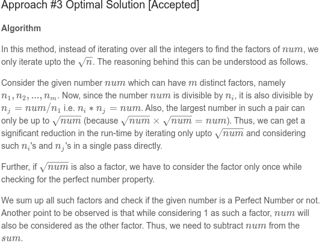
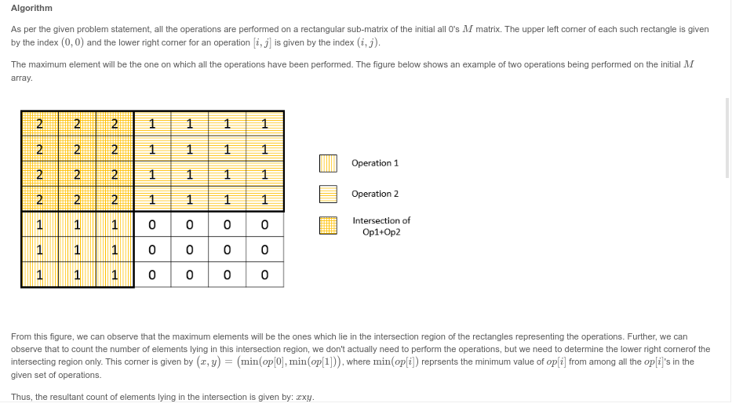

## 7. Reverse Integer

Given a 32-bit signed integer, reverse digits of an integer.

```
Example 1:

Input: 123
Output: 321
Example 2:

Input: -123
Output: -321
Example 3:

Input: 120
Output: 21

Note:
Assume we are dealing with an environment which could only store integers within the 32-bit signed integer range: [−231,  231 − 1]. For the purpose of this problem, assume that your function returns 0 when the reversed integer overflows.
```

## Solution

```cpp
class Solution {
public:
    int reverse(int x) {
       long res = 0;
       while(x){
        
            res = 10*res +x%10;
            x /= 10;
           if((res > INT_MAX) || (res < INT_MIN)) return 0;
           
       }
        
        return (int)res;
    }
};

```

## 9. Palindrome Number

Determine whether an integer is a palindrome. An integer is a palindrome when it reads the same backward as forward.

```

Example 1:

Input: 121
Output: true
Example 2:

Input: -121
Output: false
Explanation: From left to right, it reads -121. From right to left, it becomes 121-. Therefore it is not a palindrome.
Example 3:

Input: 10
Output: false
Explanation: Reads 01 from right to left. Therefore it is not a palindrome.
Follow up:

Coud you solve it without converting the integer to a string?

```

### Solution

```cpp
class Solution {
public:
    bool isPalindrome(int x) {
        
        if(x < 0) return 0;
        
        int strt = x;
        long res = 0;
        while(x){
            res = res*10 + x%10;
            x/=10;
            if(res > INT_MAX || res < INT_MIN) return 0;
        }
        return strt == res;
    }
};
```

## 13. Roman to Integer

### Solution

```cpp
unordered_map<char,int> roman_order = {{'I',1},
                                    {'V',5},
                                    {'X',10},
                                    {'L',50},
                                    {'C',100},
                                    {'D',500},
                                    {'M',1000}};

class Solution {
public:
    int romanToInt(string s) {
        int prev = 0;
        int res = 0;
        for(auto iter = s.rbegin(); iter != s.rend() ;iter++){
                    
            auto val = roman_order.find(*iter)->second;
            if(val >= prev){
                res+=val;
            }else{
                res-=val;
            }
            
            prev = val;
        }
        return res;
    }
};

```

## 67. Add Binary

Given two binary strings, return their sum (also a binary string).

The input strings are both non-empty and contains only characters 1 or 0.

```

Example 1:

Input: a = "11", b = "1"
Output: "100"
Example 2:

Input: a = "1010", b = "1011"
Output: "10101"

```

### Solution

```cpp
class Solution {
public:
    string addBinary(string a, string b) {
        
        string res;
        auto iter1 = a.rbegin();
        auto iter2 = b.rbegin();
        int c = 0;
        while(iter1 < a.rend() || iter2 < b.rend()){
            int b1 = 0 ,b2 = 0;
            if(iter1 < a.rend()) b1 = *iter1 - '0';
            if(iter2 < b.rend()) b2 = *iter2 - '0';
            
            int v = b1+b2 + c;
            c = v/2;
            v = v%2;
            res.push_back((v)?'1':'0');
            iter1++;
            iter2++;
        }
        
        if(c>0) res.push_back('1');
        reverse(res.begin(),res.end());
        return res;
        
    }
};
```

## 69. Sqrt(x)

### Solution

```cpp
class Solution {
public:
    int mySqrt(int x) {
        int l = 0,h = x;
        while(l<=h){
            long long m = l + (h-l)/2;
            long long srt = m*m;
            if(srt == x) return m;
            if(srt < x) l = m+1;
            else h = m-1;
        }
        
        return l-1;
    }
};

```

## 168. Excel Sheet Column Title

### Solution

```cpp
class Solution {
public:
    string convertToTitle(int n) {
        string res;
        while(n){
            int x = (n-1)%26;
            res.push_back(char(65+x)) ;
            n = (n-1)/26;
        }
        reverse(res.begin(),res.end());
        return res;
    }
};

```

## 171. Excel Sheet Column Number

### Solution

```cpp
class Solution {
public:
    int titleToNumber(string s) {
        
        auto iter = s.rbegin();
        int res = 0;
        long r = 1;
        while(iter != s.rend()){
            int v = *iter - 'A' + 1;
            
            res += r*v;
            r*=26;
            
            iter++;
            
        }
        
        return res;
    }
};

```

## 172. Factorial Trailing Zeroes

Given an integer n, return the number of trailing zeroes in n!.

### Solution

```cpp
class Solution {
public:
    int trailingZeroes(int n) {
        int res = 0;
        while(n>4){
            res += n/5;
            n /= 5;
        }
        
        return res;
    }
};


```


## 202. Happy Number

Write an algorithm to determine if a number n is "happy".

A happy number is a number defined by the following process: Starting with any positive integer, replace the number by the sum of the squares of its digits, and repeat the process until the number equals 1 (where it will stay), or it loops endlessly in a cycle which does not include 1. Those numbers for which this process ends in 1 are happy numbers.

Return True if n is a happy number, and False if not.
```
Example: 

Input: 19
Output: true
Explanation: 
12 + 92 = 82
82 + 22 = 68
62 + 82 = 100
12 + 02 + 02 = 1
```

### Solution


```cpp
class Solution {
public:
    bool isHappy(int n) {
        
        // Data structure to check if numbers repeat         
        unordered_map<int,int> map;
        int x = n;
        while(x){
            
            int sum = 0;
            
            // Getting all digits
            while(x){
                int d = x%10;
                x/=10;

                sum+= (d*d);
            }
            
            if(sum == 1) return 1;
            
            // Check if the sum is new or old
            if(map.find(sum)!=map.end()){
                return 0;
            }else{
               // store so that if again there is cycle we can stop
                map[sum] =1;
            }
            x = sum;
        }
               
        return 0;
        
    }
};
```


## 204. Count Primes


### Solution 

Steve

```cpp
class Solution {
public:
    int countPrimes(int n) {
        
        if(n<2) return 0;
        
        int primes [n];
        fill(primes, primes + n, 0);
        int res = 0;
        
        for(int i =2;i<n;i++){
            if(primes[i] == 0) res++;
            for(int j =1;i*j<n;j++){
                primes[i*j] = 1;
            }
        }
        return res;
    }
};
```


## 231. Power of Two

### Solution

```cpp
class Solution {
public:
    bool isPowerOfTwo(int n) {
        if(n < 1) return false;
        int count= 0;
        while(n){
            if(1&n){
                count++;
            }
            n = n>>1; 
            if(count >1) return false;
            
        }
        
        return true;
        
    }
};
```

## 258. Add Digits

Given a non-negative integer num, repeatedly add all its digits until the result has only one digit.
```
Example:

Input: 38
Output: 2 
Explanation: The process is like: 3 + 8 = 11, 1 + 1 = 2. 
             Since 2 has only one digit, return it.
Follow up:
Could you do it without any loop/recursion in O(1) runtime?
```

### Solution

```cpp
class Solution {
public:
    int addDigits(int num) {
        if(num==0) return 0;
        return num % 9 == 0 ? 9 : num % 9;
    }
};

```

## 263. Ugly Number

Write a program to check whether a given number is an ugly number.

Ugly numbers are positive numbers whose prime factors only include 2, 3, 5.

```
Example 1:

Input: 6
Output: true
Explanation: 6 = 2 × 3
Example 2:

Input: 8
Output: true
Explanation: 8 = 2 × 2 × 2
Example 3:

Input: 14
Output: false 
Explanation: 14 is not ugly since it includes another prime factor 7.
```

### Solution

```cpp
class Solution {
public:
    bool isUgly(int num) {
        
        if(num == 0 ) return false;
        while( num%2 == 0 ) num /=2;
        while( num%3 == 0 ) num /=3;
        while( num%5 == 0 ) num /=5;        
        return num == 1;
    }
};
```

## 268. Missing Number

Given an array containing n distinct numbers taken from 0, 1, 2, ..., n, find the one that is missing from the array.

```
Example 1:

Input: [3,0,1]
Output: 2
Example 2:

Input: [9,6,4,2,3,5,7,0,1]
Output: 8
Note:
Your algorithm should run in linear runtime complexity. Could you implement it using only constant extra space complexity?
```

### Solution

```cpp

class Solution {
public:
    int missingNumber(vector<int>& nums) {
        int sm = (nums.size())*(nums.size()+1)/2; 
        for(auto x:nums){
            sm-=x;
        }
        return sm;
    }
    
    int missingNumber(vector<int>& nums) {
        int sm = nums.size();
        for(int i = 0;i<nums.size();i++){
            sm = sm ^ i ^ nums[i]; 
        }
        return sm;
    }
};
```

## 367. Valid Perfect Square

Given a positive integer num, write a function which returns True if num is a perfect square else False.

Follow up: Do not use any built-in library function such as sqrt.

```
Example 1:

Input: num = 16
Output: true
Example 2:

Input: num = 14
Output: false

```

### Solution

```cpp
class Solution {
public:
    bool isPerfectSquare(int num) {
        
        int l = 0,h = num;
        while(l<=h){
            long int m = l + (h-l)/2;
            long sq = m*m;
            if(sq == num) return true;
            if(sq < num) l = m+1;
            else h = m-1;
        }
        
        return false;
    }
};

```

## 441. Arranging Coins

You have a total of n coins that you want to form in a staircase shape, where every k-th row must have exactly k coins.

Given n, find the total number of full staircase rows that can be formed.

n is a non-negative integer and fits within the range of a 32-bit signed integer.

```
Example 1:

n = 5

The coins can form the following rows:
¤
¤ ¤
¤ ¤

Because the 3rd row is incomplete, we return 2.
Example 2:

n = 8

The coins can form the following rows:
¤
¤ ¤
¤ ¤ ¤
¤ ¤

Because the 4th row is incomplete, we return 3.
```

### Solution

```cpp
class Solution {
public:
    int arrangeCoins(int n) {
        long long low=1,high=n;
        
        while(low<=high)
        {
            long long mid=low+(high-low)/2;
            long long s=mid*(mid+1)/2;
            if(s==n) return mid;
            else if(s<n) low=mid+1;
            else high=mid-1;
        }
        
        return low-1;
    }
};

```

## 453. Minimum Moves to Equal Array Elements

Given a non-empty integer array of size n, find the minimum number of moves required to make all array elements equal, where a move is incrementing n - 1 elements by 1.
```
Example:

Input:
[1,2,3]

Output:
3

Explanation:
Only three moves are needed (remember each move increments two elements):

[1,2,3]  =>  [2,3,3]  =>  [3,4,3]  =>  [4,4,4]
```

### Solution

Insight 1: when the problem says "incrementing n-1 elements by 1", notice that this is the same as saying "decrementing 1 element by 1". If you're increasing n-1 elements by 1 (meaning increasing all but one element), it is the same as decreasing that one element by 1. This will make the solution much easier.

Insight 2: given a certain element A, and using "Insight 1", in order for all the elements to be the same at the end, inevitably we'll have to transform A into the minimum element in the array. Hence, for a given element A, there will be at least A - Min(Array) moves to get to the solution. In fact the solution will then be the summation of Ai - Min(Array) for every Ai in the array.

Insight 3: given "Insight 2", we can do some math to land at the final formula to solve the problem in linear time:
Solution = A1 - Min(Array) + A2 - Min(Array) + ... + An - Min(Array)
Solution = (A1 + A2 + A3 + ... + An) - n*Min(Array)
Solution = Sum(Array) - n*Min(Array)


```cpp
class Solution {
public:
    int minMoves(vector<int>& nums) {
        
        int MIN = INT_MAX;
        long sm = 0;
        for(auto x:nums){
            if(x < MIN) MIN = x;
        }
        
        for(auto x:nums){
            sm += x -MIN;
        }
        
        return sm ;
    }
};
```


## 507. Perfect Number

We define the Perfect Number is a positive integer that is equal to the sum of all its positive divisors except itself.

Now, given an integer n, write a function that returns true when it is a perfect number and false when it is not.

```
Example:
Input: 28
Output: True
Explanation: 28 = 1 + 2 + 4 + 7 + 14

```

### Solution



```cpp
class Solution {
public:
    bool checkPerfectNumber(int num) {
        
        if(num < 1) return false;
        int sm = 0;
        for(int i =1;i*i<=num;i++){
            if(num%i == 0){
                sm+=i;
                if(i*i != num) sm += num/i;
            }
            
            
        }
        
        return sm -num == num;
    }
};

```

## 598. Range Addition II

Given an m * n matrix M initialized with all 0's and several update operations.

Operations are represented by a 2D array, and each operation is represented by an array with two positive integers a and b, which means M[i][j] should be added by one for all 0 <= i < a and 0 <= j < b.

You need to count and return the number of maximum integers in the matrix after performing all the operations.

```
Example 1:
Input: 
m = 3, n = 3
operations = [[2,2],[3,3]]
Output: 4
Explanation: 
Initially, M = 
[[0, 0, 0],
 [0, 0, 0],
 [0, 0, 0]]

After performing [2,2], M = 
[[1, 1, 0],
 [1, 1, 0],
 [0, 0, 0]]

After performing [3,3], M = 
[[2, 2, 1],
 [2, 2, 1],
 [1, 1, 1]]

So the maximum integer in M is 2, and there are four of it in M. So return 4.
```

### Solution



```cpp
class Solution {
public:
    int maxCount(int m, int n, vector<vector<int>>& ops) {
        for(auto op: ops){
            m = min(m,op[0]);
            n = min(n,op[1]);
        }
        return m*n;
        
    }
};

```

## 628. Maximum Product of Three Numbers

Given an integer array, find three numbers whose product is maximum and output the maximum product.
```
Example 1:

Input: [1,2,3]
Output: 6
 

Example 2:

Input: [1,2,3,4]
Output: 24
```
### Solution

Thus, either the product nums[0] \times nums[1] \times nums[n-1]nums[0]×nums[1]×nums[n−1] or    
nums[n-3] \times nums[n-2] \times nums[n-1]nums[n−3]×nums[n−2]×nums[n−1] will give the required result.  
Thus, we need to find the larger one from out of these values.

```cpp
class Solution {
public:
    int maximumProduct(vector<int>& nums) {
        sort(nums.begin(),nums.end());
        int lst = nums.size() -1;
        return max(nums[0]*nums[1]*nums[lst],nums[lst]*nums[lst-1]*nums[lst-2]); 
    }
    
    int maximumProduct(vector<int>& nums) {
        int min1,min2;
        min1 = min2 = INT_MAX;
        
        int max1,max2,max3;
        max1 = max2 = max3 = INT_MIN;
        
        for(auto x: nums){
            if(x < min1){ 
                min2 = min1;
                min1 = x;
            }else if(x < min2){
                min2 = x;
            }
            
            if(x > max1){
                max3 = max2;
                max2 = max1;
                max1 = x;
            }else if(x > max2){
                max3 = max2;
                max2 = x;
            }else if(x > max3){
                max3 = x;
            }
        }
        
        return max(min1*min2*max1,max3*max2*max1);
    }
};

```

## 633. Sum of Square Numbers

Given a non-negative integer c, your task is to decide whether there're two integers a and b such that a2 + b2 = c.
```
Example 1:

Input: 5
Output: True
Explanation: 1 * 1 + 2 * 2 = 5
 

Example 2:

Input: 3
Output: False
```

### Solution

```cpp
class Solution {
public:
    bool judgeSquareSum(int c) {
        for (long a = 0; a * a <= c; a++) {
            double b = sqrt(c - a * a);
            if (b == (int) b)
                return true;
        }
        return false;
    }
};

```