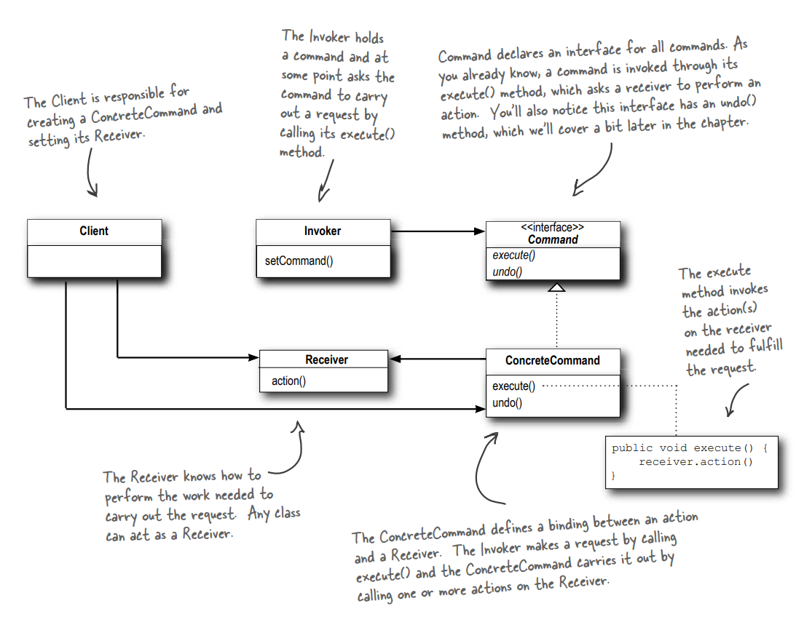

# Command Pattern

- Command is a behavioral design pattern that turns a request into a stand-alone object that contains all information about the request. This transformation lets you pass requests as a method arguments, delay or queue a request’s execution, and support undoable operations.




```java
// command interface/contract
public interface Command {
 public void execute();
}

// concreate command
public class LightOnCommand implements Command {
Light light;

 public LightOnCommand(Light light) {
    this.light = light;
 }
 public void execute() {
    light.on();
 }
}

// invoker
// doesn't know about light
// just calls execute
public class SimpleRemoteControl {
 Command slot;
 
 public SimpleRemoteControl() {}

 public void setCommand(Command command) {
    slot = command;
 }
 public void buttonWasPressed() {
    slot.execute();
 }
}

// client
// create the reviver
// creates the cmd
// connects command to reciver
// asigns command to invoker
public class RemoteControlTest {
 public static void main(String[] args) {
    SimpleRemoteControl remote = new SimpleRemoteControl();
    
    // Recivere
    // the object that actually perforns the action
    // how to turn the light on
    Light light = new Light();
    LightOnCommand lightOn = new LightOnCommand(light);

    remote.setCommand(lightOn);
    remote.buttonWasPressed();
 }
}

```