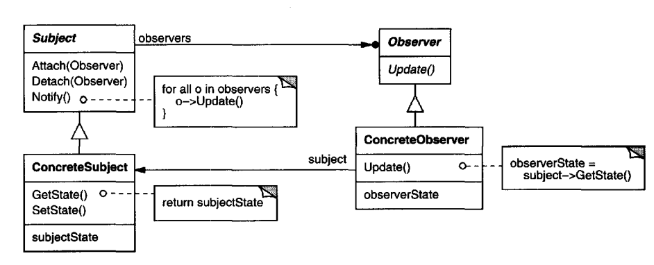

# Observer Pattern

- Observer is a behavioral design pattern that lets you define a subscription mechanism to notify multiple objects about any events that happen to the object they’re observing.

- The Observer pattern suggests that you add a subscription mechanism to the publisher class so individual objects can subscribe to or unsubscribe from a stream of events coming from that publisher.
- Fear not! Everything isn’t as complicated as it sounds. In reality, this mechanism consists of
    1. An array field for storing a list of references to subscriber objects and
    1. several public methods which allow adding subscribers to and removing them from that list.
- Now, whenever an important event happens to the publisher, it goes over its subscribers and calls the specific notification method on their objects.



### Participants
- Subject
    - knows its observers. Any number of Observer objects may observe a subject.
    - provides an interface for attachingand detaching Observer objects.
- Observer
    - defines an updating interface for objects that should be notified ofchanges
    in a subject.
- ConcreteSubject
    - stores state ofinterest toConcreteObserver objects.
    - sends a notification to its observers when itsstate changes.
- ConcreteObserver
    - maintains a reference to a ConcreteSubject object.
    - stores state that should stay consistent with the subject's.
    - implements the Observer updating interface to keep its state consistent
    with the subject's.
### Applicability
- Use the Observer pattern when changes to the state of one object may require changing other objects, and the actual set of objects is unknown beforehand or changes dynamically.

- Use the pattern when some objects in your app must observe others, but only for a limited time or in specific cases.

### How to Implement
1. Look over your business logic and try to break it down into two parts: the core functionality, independent from other code, will act as the publisher; the rest will turn into a set of subscriber classes.
1. Declare the subscriber interface. At a bare minimum, it should declare a single update method.
1. Declare the publisher interface and describe a pair of methods for adding a subscriber object to and removing it from the list. Remember that publishers must work with subscribers only via the subscriber interface.
1. Decide where to put the actual subscription list and the implementation of subscription methods. Usually, this code looks the same for all types of publishers, so the obvious place to put it is in an abstract class derived directly from the publisher interface. Concrete publishers extend that class, inheriting the subscription behavior.
    
    However, if you’re applying the pattern to an existing class hierarchy, consider an approach based on composition: put the subscription logic into a separate object, and make all real publishers use it.
1. Create concrete publisher classes. Each time something important happens inside a publisher, it must notify all its subscribers.
1. Implement the update notification methods in concrete subscriber classes. Most subscribers would need some context data about the event. It can be passed as an argument of the notification method.

    But there’s another option. Upon receiving a notification, the subscriber can fetch any data directly from the notification. In this case, the publisher must pass itself via the update method. The less flexible option is to link a publisher to the subscriber permanently via the constructor.
1. The client must create all necessary subscribers and register them with proper publishers.

### Pseudocode

```cpp
// The base publisher class includes subscription management
// code and notification methods.
class EventManager is
    private field listeners: hash map of event types and listeners

    method subscribe(eventType, listener) is
        listeners.add(eventType, listener)

    method unsubscribe(eventType, listener) is
        listeners.remove(eventType, listener)

    method notify(eventType, data) is
        foreach (listener in listeners.of(eventType)) do
            listener.update(data)

// The concrete publisher contains real business logic that's
// interesting for some subscribers. We could derive this class
// from the base publisher, but that isn't always possible in
// real life because the concrete publisher might already be a
// subclass. In this case, you can patch the subscription logic
// in with composition, as we did here.
class Editor is
    public field events: EventManager
    private field file: File

    constructor Editor() is
        events = new EventManager()

    // Methods of business logic can notify subscribers about
    // changes.
    method openFile(path) is
        this.file = new File(path)
        events.notify("open", file.name)

    method saveFile() is
        file.write()
        events.notify("save", file.name)

    // ...


// Here's the subscriber interface. If your programming language
// supports functional types, you can replace the whole
// subscriber hierarchy with a set of functions.
interface EventListener is
    method update(filename)

// Concrete subscribers react to updates issued by the publisher
// they are attached to.
class LoggingListener implements EventListener is
    private field log: File
    private field message: string

    constructor LoggingListener(log_filename, message) is
        this.log = new File(log_filename)
        this.message = message

    method update(filename) is
        log.write(replace('%s',filename,message))

class EmailAlertsListener implements EventListener is
    private field email: string
    private field message: string

    constructor EmailAlertsListener(email, message) is
        this.email = email
        this.message = message

    method update(filename) is
        system.email(email, replace('%s',filename,message))


// An application can configure publishers and subscribers at
// runtime.
class Application is
    method config() is
        editor = new Editor()

        logger = new LoggingListener(
            "/path/to/log.txt",
            "Someone has opened the file: %s")
        editor.events.subscribe("open", logger)

        emailAlerts = new EmailAlertsListener(
            "admin@example.com",
            "Someone has changed the file: %s")
        editor.events.subscribe("save", emailAlerts)
```