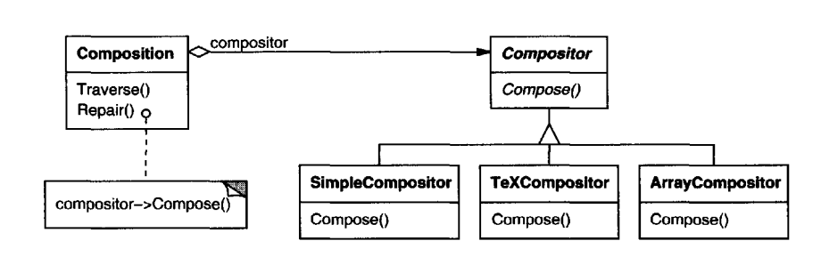

# Strategy pattern
- Strategy is a behavioral design pattern that lets you define a family of algorithms, put each of them into a separate class, and make their objects interchangeable.

- The Strategy pattern suggests that you take a class that does something specific in a lot of different ways and extract all of these algorithms into separate classes called strategies.

- The original class, called context, must have a field for storing a reference to one of the strategies. The context delegates the work to a linked strategy object instead of executing it on its own.

- The context isn’t responsible for selecting an appropriate algorithm for the job. Instead, the client passes the desired strategy to the context. In fact, the context doesn’t know much about strategies.
- It works with all strategies through the same generic interface, which only exposes a single method for triggering the algorithm encapsulated within the selected strategy.
- This way the context becomes independent of concrete strategies, so you can add new algorithms or modify existing ones without changing the code of the context or other strategies.



### Applicability
- Use the Strategy pattern when you want to use different variants of an algorithm within an object and be able to switch from one algorithm to another during runtime.
- Use the Strategy when you have a lot of similar classes that only differ in the way they execute some behavior.
- Use the pattern to isolate the business logic of a class from the implementation details of algorithms that may not be as important in the context of that logic.
- Use the pattern when your class has a massive conditional statement that switches between different variants of the same algorithm.

### How to Implement
1. In the context class, identify an algorithm that’s prone to frequent changes. It may also be a massive conditional that selects and executes a variant of the same algorithm at runtime.
2. Declare the strategy interface common to all variants of the algorithm.
3. One by one, extract all algorithms into their own classes. They should all implement the strategy interface.
4. In the context class, add a field for storing a reference to a strategy object. Provide a setter for replacing values of that field. The context should work with the strategy object only via the strategy interface. The context may define an interface which lets the strategy access its data.
6. Clients of the context must associate it with a suitable strategy that matches the way they expect the context to perform its primary job.

### Pusedo Code
```cpp
// The strategy interface declares operations common to all
// supported versions of some algorithm. The context uses this
// interface to call the algorithm defined by the concrete
// strategies.
interface Strategy is
    method execute(a, b)

// Concrete strategies implement the algorithm while following
// the base strategy interface. The interface makes them
// interchangeable in the context.
class ConcreteStrategyAdd implements Strategy is
    method execute(a, b) is
        return a + b

class ConcreteStrategySubtract implements Strategy is
    method execute(a, b) is
        return a - b

class ConcreteStrategyMultiply implements Strategy is
    method execute(a, b) is
        return a * b

// The context defines the interface of interest to clients.
class Context is
    // The context maintains a reference to one of the strategy
    // objects. The context doesn't know the concrete class of a
    // strategy. It should work with all strategies via the
    // strategy interface.
    private strategy: Strategy

    // Usually the context accepts a strategy through the
    // constructor, and also provides a setter so that the
    // strategy can be switched at runtime.
    method setStrategy(Strategy strategy) is
        this.strategy = strategy

    // The context delegates some work to the strategy object
    // instead of implementing multiple versions of the
    // algorithm on its own.
    method executeStrategy(int a, int b) is
        return strategy.execute(a, b)


// The client code picks a concrete strategy and passes it to
// the context. The client should be aware of the differences
// between strategies in order to make the right choice.
class ExampleApplication is
    method main() is
        Create context object.

        Read first number.
        Read last number.
        Read the desired action from user input.

        if (action == addition) then
            context.setStrategy(new ConcreteStrategyAdd())

        if (action == subtraction) then
            context.setStrategy(new ConcreteStrategySubtract())

        if (action == multiplication) then
            context.setStrategy(new ConcreteStrategyMultiply())

        result = context.executeStrategy(First number, Second number)

        Print result.
```