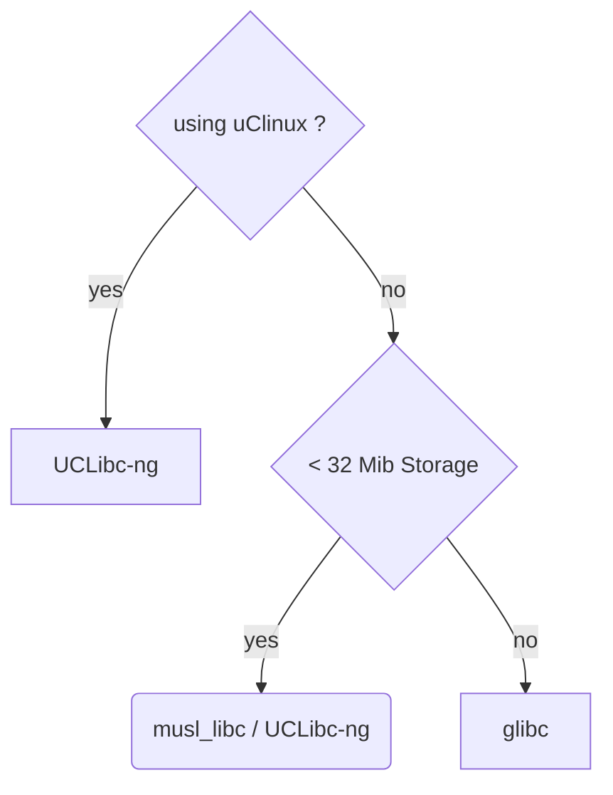

### Topics
- [Technical Requirements](#technical-requirements)
- [Intro to Toolchain](#intro-to-toolchain)
- [Types of toolchains](#types-of-toolchains)
- [CPU Architectures](#cpu-architectures)
- [Choosing C library](#choosing-c-library)
- [Anatomy of a toolchain](#anatomy-of-a-toolchain)
    - [Finding out about your cross compiler](#finding-out-about-your-cross-compiler)
    - [sysroot, library and header files](#sysroot-library-and-header-files)
    - [Other tools in the toolchain](#other-tools-in-the-toolchain)
- [Static libraries](#static-libraries)
- [Shared libraries](#dynamic-libraries)
    - [Shared library version numbers](#shared-library-version-numbers)
- [Autotools machine types](#autotools-machine-types)
- [Package configuration](#package-configuration)


### Technical Requirements
```bash
$ sudo apt-get install autoconf automake bison bzip2 cmake \ 
flex g++ gawk gcc
gettext git gperf help2man libncurses5-dev libstdc++6 libtool \ 
libtool-bin make
patch python3-dev rsync texinfo unzip wget xz-utils
```

### Intro to Toolchain
- A set of tools that compiles the source code into executables that can run on your target and includes a `compiler`, a `linker` and `runtime libs`.
- Initially you need one to build the other three elements: the bootloader, the kernel and the root fs.
- It has to compile code written in Assembly, C and C++ (since these languages are used in the base open source packages).
- Toolchain are based from the `GNU` project. However `Clang` have come a long way as an alternative to GNU toolchain.

There is a good description of how to use `Clang` for `cross-compilation` at [CrossCompilation](
https://clang.llvm.org/docs/CrossCompilation.html)

A standard GNU toolchain consists of three main components:
1. **Binutils**: A set of binary utilities including the assembler and linker.
2. **GCC**: Compilers for C and other languages
3. **C library**: A standard `application program interface (API)` based on the POSIX specification. Its the main interface to the operating system kernel for applications.

Along with this we will need `linux kernel headers` which contains the definitions and constants that are needed when accessing the kernel directly.

`GNU Debugger (GDB)` can be considered as part of the toolchain as well.

### Types of toolchains
1. **Native**: Runs on the same type of system as the programs it generates.
2. **Cross**: Runs on different type of system than the target, allowing the development to be done on a fast desktop PC and then loading the artifacts onto the embedded target device.

> **Note**: The toolchain should remain constant throughout the life of the project.

### CPU Architectures
Toolchain has to be built according to the capabilities of the target CPU, which includes:
- `CPU architecture`: `ARM`, `MIPS`, `x86_64` and so on.
- `Big or Little-endian operations`
- `Floating point support`: Not all embedded process have floating point support
- `Application Binary Interface (ABI)`: Calling convention for passing parameters between function calls.

ARM architecture has `Extended Application Binary Interface (EABI)`
- Original EABI is for general-purpose (integer) registers
- While `Extended Application Binary Interface Hard-Float (EABIHF)` uses floating point registers.

GNU uses a prefix to the name of each tool in the toolchain to identify various combinations that can be generated.
- `CPU`: ARM, MIPS, x86_64. `el` : little endian or `eb` : for big endian. eg `armeb`
- `Vendor`: Provider of the toolchain eg `buildroot`, `poky` or just `unknown`.
- `Kernel`: its is always linux
- `OS`: Name for the user space component which might be `gnu` or `musl`. ABI may be appended here as well eg `gnueabi, gnueabihf, musleabi or musleabihf`

To find the tuple used when building the toolchain use:
```bash
$ gcc -dumpmachine
x86_64-linux-gnu

CPU : x86_64
kernel: linux
user space: gnu
```

```bash
$ mipsl-unknown-linux-gnu-gcc - umpmachine
mipsel-unknown-linux-gnu

cpu: mips little endian
vendor: unknown
kernel: linux
user space: gnu
```

### Choosing C library

- `C library` it is the gateway to the kernel for linux program.
- Even if other language will have support libraries will have to call the C lib eventually.

```bash
APP -> C LIB -> Linux Kernel
```
- It is possible to bypass the C lib by making the kernel system calls directly, but its difficult and unnecessary.
- Various Clibs are present
    - `glibc`: standard GNU C lib. It is big and until now not very configurable but it the most complete implementation fo the POSIX API.
    - `musl libc`: good for limited amount of RAM and storage.
    - `uClibc-ng`: micro controller C lib.



## Anatomy of a toolchain
### Finding out about your cross compiler

```bash
$ aarch64-buildroot-linux-gnu-gcc --version 
```

To find how it was configured, use -v:
```bash
$ aarch64-buildroot-linux-gnu-gcc -v
```
Interesting outputs are:
- `--with-sysroot`
- `--enable-languages=c,c++`
- `--with-cpu=cortex-a8`
- `--enable-threads`

We can override the config eg:
```bash
$ arm-cortex_a8-linux-gnueabihf-gcc -mcpu=cortex-a5 helloworld.c -o helloworld 
```
To print range of architecture specific options use `--target-help`

### sysroot, library and header files

- `sysroot` is a directory that contains subdirectories for libs header files and other configuration files.
- It can be set with toolchain using `--with-sysroot=` or can be set on the command line using `--sysroot=`.
- To get the location of the sysroot:
```bash
$ arm-cortex_a8-linux-gnueabihf-gcc -print-sysroot

/home/frank/x-tools/arm-cortex_a8-linux-gnueabihf/arm-cortex_
a8-linux-gnueabihf/sysroot 
```
- You will find other subdirectories under `sysroot`:
    - `lib`:  contains shared object for c lib and the dynamic linker/loader `ld-linux`
    - `usr/lib`:  static libs archive files
    - `usr/include`: header for all the libs
    - `usr/bin`: utility program that run on the target such as `ldd` cmd
    - `usr/share`: used for localization and internationalization.
    - `sbin`: provides the `ldconfig` utility used to optimize lib loading paths.

Some of these are needed during host compilation process and other like shared libs and `ld-linux` are needed on the target at runtime.

### Other tools in the toolchain
Present inside `~/aarch64--glibc--stabl-2024.02-1/bin/` :
- `addr2line`: Converts program addresses into filenames and numbers by reading  the debug symbol tables in an executable file.
- `ar`: The archive utility is used to create static libraries.
- `as`: This is the GNU assembler.
- `c++filt`: This is used to demangle C++ and Java symbols.
- `cpp`: This is the C preprocessor and is used to expand `#define`, `#include`, and  other similar directives.
- `elfedit`: This is used to update the ELF header of the ELF files.
- `g++`: This is the GNU C++ frontend, which assumes that source files contain C++ code.
- `gcc`: This is the GNU C frontend, which assumes that source files contain C code.
- `gcov`: This is a code coverage tool.
- `gdb`: This is the GNU debugger.
- `gprof`: This is a program profiling tool.
- `ld`: This is the GNU linker.
- `nm`: This lists symbols from object files.
- `objcopy`: This is used to copy and translate object files.
- `objdump`: This is used to display information from object files.
- `ranlib`: This creates or modifies an index in a static library, making the linking stage faster.
- `readelf`: This displays information about files in ELF object format.
- `size`: This lists section sizes and the total size.
- `strings`: This displays strings of printable characters in files.
- `strip`: This is used to strip an object file of debug symbol tables, thus making it smaller.

You can verify which libraries have been linked in this or any other program by using the readelf command:
```bash
$ arm-cortex_a8-linux-gnueabihf-readelf -a myprog | grep 
"Shared library"
 0x00000001 (NEEDED)               Shared library: [libm.so.6]
 0x00000001 (NEEDED)               Shared library: [libc.so.6]
```
Shared libraries need a runtime linker, which you can expose using this:
```bash
$ arm-cortex_a8-linux-gnueabihf-readelf -a myprog | grep 
"program interpreter"
    [Requesting program interpreter: /lib/ld-linux-armhf.so.3]
```

### Static libraries

You can link all the libraries statically by adding -static to the command line:
```bash
$ arm-cortex_a8-linux-gnueabihf-gcc -static helloworld.c -o 
helloworld-static
```

Static linking pulls code from a library archive, usually named lib[name].a. In the preceding case, it is `libc.a`, which is in `[sysroot]/usr/lib`:
```bash
$ export SYSROOT=$(arm-cortex_a8-linux-gnueabihf-gcc -print
sysroot)
$ cd $SYSROOT
$ ls -l usr/lib/libc.a-rw-r--r-- 1 frank frank 31871066 Oct 23 15:16 usr/lib/libc.a
```
Creating a static library is as simple as creating an archive of object files using the ar command.
```bash
$ arm-cortex_a8-linux-gnueabihf-gcc -c test1.c
$ arm-cortex_a8-linux-gnueabihf-gcc -c test2.c
$ arm-cortex_a8-linux-gnueabihf-ar rc libtest.a test1.o test2.o
$ ls -l

total 24
-rw-rw-r-- 1 frank frank 2392 Oct 9 09:28 libtest.a
-rw-rw-r-- 1 frank frank 116 Oct 9 09:26 test1.c
-rw-rw-r-- 1 frank frank 1080 Oct 9 09:27 test1.o
-rw-rw-r-- 1 frank frank 121 Oct 9 09:26 test2.c
-rw-rw-r-- 1 frank frank 1088 Oct 9 09:27 test
```

link libtest into my helloworld program, using this:
```bash
$ arm-cortex_a8-linux-gnueabihf-gcc helloworld.c -ltest \-L../libs -I../libs -o hello
```

### Dynamic libraries
The object code for a shared library must be position-independent, so that the runtime linker is free to locate it in memory at the next free address.
To do this, add the `-fPIC` parameter to gcc, and then link it using the `-shared` option:
```bash
$ arm-cortex_a8-linux-gnueabihf-gcc -fPIC -c test1.c
$ arm-cortex_a8-linux-gnueabihf-gcc -fPIC -c test2.c
$ arm-cortex_a8-linux-gnueabihf-gcc -shared -o libtest.so 
test1.o test2.o
```

Why `-fPIC` has to be passed along with `-shared` ?

- The reason you must explicitly pass `-fPIC` alongside `-shared` boils down to the strict separation between compiling and linking in C/C++ toolchains. `-fPIC` is a compiler flag that dictates how the machine code is generated—forcing relative addressing so the code can be safely loaded anywhere in memory—while `-shared` is a linker flag that merely packages pre-compiled object files into a library.
- Because compilation happens first, the linker cannot retroactively rewrite absolute addresses into relative ones if you forget `-fPIC` during the compile step.
- Furthermore, keeping the flags separate provides flexibility, allowing developers to use position-independent code for modern, secure executables `(PIE)` rather than just shared libraries, and historically allowed them to opt out of PIC for minor performance gains on older architectures.

If you want it to look for libraries in other directories as well, 
you can place a colon-separated list of paths in the `LD_LIBRARY_PATH` shell variable:
```bash
$ export LD_LIBRARY_PATH=/opt/lib:/opt/usr/lib
```
### Shared library version numbers

- `libjpeg.so` -> `libjpeg.so.8.2.2`: A symbolic link used for dynamic linking.
- `libjpeg.so.8` -> `libjpeg.so.8.2.2`: A symbolic link used when loading the library at runtime.
- `libjepg.so.8.2.2`: the actual shared lib used at both compile time  and runtime.

Why are the symlinks necessary ?

**`The Compile-Time Symlink (libjpg.so)`**

**Why it's required**: When a developer writes a program and compiles it, they tell the compiler to link the JPEG library using a generic flag: `-ljpg`.

By rule, the compiler's linker translates -ljpg into a search for a file named exactly libjpg.so.

**What if the symlink didn't exist?** Developers would have to hardcode the exact version into their build scripts (e.g., gcc main.c `/usr/lib/libjpg.so.8.2.2`). Every time a minor bug-fix update was released, every developer's build script (Makefile) would break and have to be manually rewritten to point to `8.2.3`.

**The Symlink Solution**: The symlink ensures that `-ljpg` always automatically grabs the newest, most up-to-date version installed on the developer's machine without them having to change their build commands.

**`The Run-Time Symlink (libjpg.so.8 / The SONAME)`**

**Why it's required**: When you compile your program, it records the `SONAME (libjpg.so.8)` inside your final executable. It basically says, "I need ABI version 8 to run properly." When the user double-clicks your program, the operating system looks for a file named `libjpg.so.8.`

**What if the symlink didn't exist?** If your executable recorded the exact file name `(libjpg.so.8.2.2)`, it would be permanently tied to that exact file. If a critical security vulnerability was found, and the Linux distribution pushed an update to `8.2.3`, the OS would delete `8.2.2` and install `8.2.3`. Suddenly, your program (and hundreds of others) would crash because `8.2.2` is missing. You would have to recompile every single program on the computer just to use the security patch.

**The Symlink Solution**: By having the program ask for the symlink `(libjpg.so.8)`, the OS can just update the symlink to point to the new `libjpg.so.8.2.3` file. The next time you open your program, it asks for `libjpg.so.8`, gets silently redirected to `8.2.3`, and runs perfectly with the new security patch—no recompiling required!

**Summary**
- `libjpg.so` is required so you don't have to rewrite your code/makefiles every time the library updates.
- `libjpg.so.8` is required so you don't have to recompile all your apps every time the library gets a bug fix or security patch.

### Autotools machine types
- **Build**: The computer that builds the package, which defaults to the current machine.
- **Host**: The computer the program will run on. For a native compile, this is left blank and it defaults to be the same computer as Build. When you are cross-compiling, set it to be the tuple of your toolchain.
- **Target**: The computer the program will generate code for. You would set this when building a cross compiler

### Package configuration

The package configuration utility `pkg-config` helps track which packages are installed and which compile flags each package needs by keeping a database of `Autotools` packages in `<sysroot>/usr/lib/pkgconfig`.

For instance, the one for `SQLite3` is named `sqlite3.pc` and contains 
essential information needed by other packages that need to make use of it:
```bash
$ cat $(arm-cortex_a8-linux-gnueabihf-gcc -print-sysroot)/usr/
lib/pkgconfig/sqlite3.pc

# Package Information for pkg-config
prefix=/usr
exec_prefix=${prefix}
libdir=${exec_prefix}/lib
includedir=${prefix}/include

Name: SQLite
Description: SQL database engine
Version: 3.33.0
Libs: -L${libdir} -lsqlite3
Libs.private: -lm -ldl -lpthread 
Cflags: -I${includedir}
```

You can use `pkg-config` to extract information in a form that you can feed straight to gcc. In the case of a library like `libsqlite3`, you want to know the library name `(--libs)` and any special C flags (--cflags):
```bash
$ pkg-config sqlite3 --libs --cflags
Package sqlite3 was not found in the pkg-config search path.
Perhaps you should add the directory containing 'sqlite3.pc'
to the PKG_CONFIG_PATH environment variable
No package 'sqlite3' found 
```

Oops! That failed because it was looking in the host's sysroot and the development package for `libsqlite3` has not been installed on the host. 
You need to point it at the `sysroot` of the target toolchain by setting the `PKG_CONFIG_LIBDIR` shell variable:
```bash
export PKG_CONFIG_LIBDIR=$(arm-cortex_a8-linux-gnueabihf-gcc \-print-sysroot)/usr/lib/pkgconfig

$ pkg-config sqlite3 --libs --cflags-lsqlite3
```
The final commands to compile would be the following:
```bash
$ export PKG_CONFIG_LIBDIR=$(arm-cortex_a8-linux-gnueabihf-gcc \-print-sysroot)/usr/lib/pkgconfig

$ arm-cortex_a8-linux-gnueabihf-gcc $(pkg-config sqlite3 --cflags --libs) \
sqlite-test.c -o sqlite-test
```

**Toolchain Options in 2023**: `What’s new in compilers and libcs?` by
Bernhard “Bero” Rosenkränzer 
[What’s new in compilers and libcs](https://www.youtube.com/watch?v=Vgm3GJ2ItDA)

**Modern CMake for modular design, by athieu Ropert**
[Modern CMake for modular design, by athieu Ropert](https://www.youtube.com/watch?v=eC9-iRN2b04)
