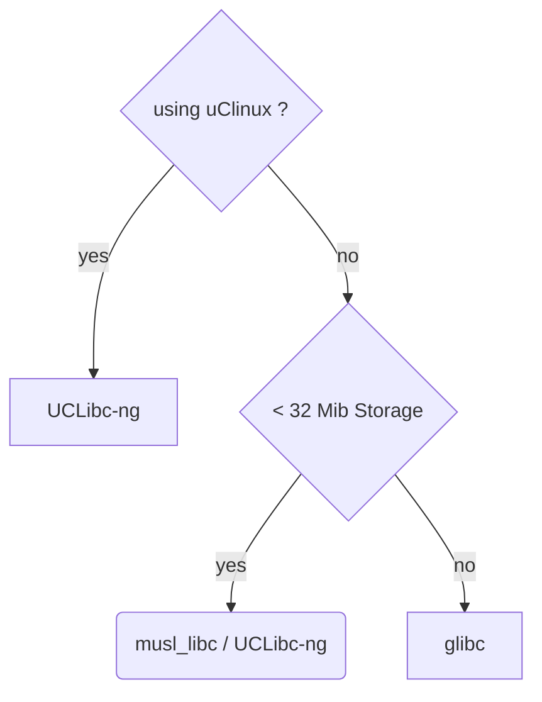

### Topics
- [Technical Requirements](#technical-requirements)
- [Intro to Toolchain](#intro-to-toolchain)
- [Types of toolchains](#types-of-toolchains)
- [CPU Architectures](#cpu-architectures)

### Technical Requirements
```bash
$ sudo apt-get install autoconf automake bison bzip2 cmake \ 
flex g++ gawk gcc
gettext git gperf help2man libncurses5-dev libstdc++6 libtool \ 
libtool-bin make
patch python3-dev rsync texinfo unzip wget xz-utils
```

### Intro to Toolchain
- A set of tools that compiles the source code into executables that can run on your target and includes a `compiler`, a `linker` and `runtime libs`.
- Initially you need one to build the other three elements: the bootloader, the kernel and the root fs.
- It has to compile code written in Assembly, C and C++ (since these languages are used in the base open source packages).
- Toolchain are based from the `GNU` project. However `Clang` have come a long way as an alternative to GNU toolchain.

There is a good description of how to use `Clang` for `cross-compilation` at [CrossCompilation](
https://clang.llvm.org/docs/CrossCompilation.html)

A standard GNU toolchain consists of three main components:
1. **Binutils**: A set of binary utilities including the assembler and linker.
2. **GCC**: Compilers for C and other languages
3. **C library**: A standard `application program interface (API)` based on the POSIX specification. Its the main interface to the operating system kernel for applications.

Along with this we will need `linux kernel headers` which contains the definitions and constants that are needed when accessing the kernel directly.

`GNU Debugger (GDB)` can be considered as part of the toolchain as well.

### Types of toolchains
1. **Native**: Runs on the same type of system as the programs it generates.
2. **Cross**: Runs on different type of system than the target, allowing the development to be done on a fast desktop PC and then loading the artifacts onto the embedded target device.

> **Note**: The toolchain should remain constant throughout the life of the project.

### CPU Architectures
Toolchain has to be built according to the capabilities of the target CPU, which includes:
- `CPU architecture`: `ARM`, `MIPS`, `x86_64` and so on.
- `Big or Little-endian operations`
- `Floating point support`: Not all embedded process have floating point support
- `Application Binary Interface (ABI)`: Calling convention for passing parameters between function calls.

ARM architecture has `Extended Application Binary Interface (EABI)`
- Original EABI is for general-purpose (integer) registers
- While `Extended Application Binary Interface Hard-Float (EABIHF)` uses floating point registers.

GNU uses a prefix to the name of each tool in the toolchain to identify various combinations that can be generated.
- `CPU`: ARM, MIPS, x86_64. `el` : little endian or `eb` : for big endian. eg `armeb`
- `Vendor`: Provider of the toolchain eg `buildroot`, `poky` or just `unknown`.
- `Kernel`: its is always linux
- `OS`: Name for the user space component which might be `gnu` or `musl`. ABI may be appended here as well eg `gnueabi, gnueabihf, musleabi or musleabihf`

To find the tuple used when building the toolchain use:
```bash
$ gcc -dumpmachine
x86_64-linux-gnu

CPU : x86_64
kernel: linux
user space: gnu
```

```bash
$ mipsl-unknown-linux-gnu-gcc - umpmachine
mipsel-unknown-linux-gnu

cpu: mips little endian
vendor: unknown
kernel: linux
user space: gnu
```

### Choosing C library

- `C library` it is the gateway to the kernel for linux program.
- Even if other language will have support libraries will have to call the C lib eventually.

```bash
APP -> C LIB -> Linux Kernel
```
- It is possible to bypass the C lib by making the kernel system calls directly, but its difficult and unnecessary.
- Various Clibs are present
    - `glibc`: standard GNU C lib. It is big and until now not very configurable but it the most complete implementation fo the POSIX API.
    - `musl libc`: good for limited amount of RAM and storage.
    - `uClibc-ng`: micro controller C lib.


