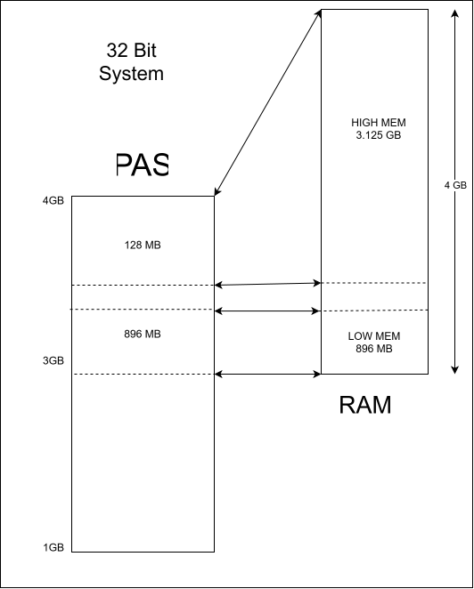
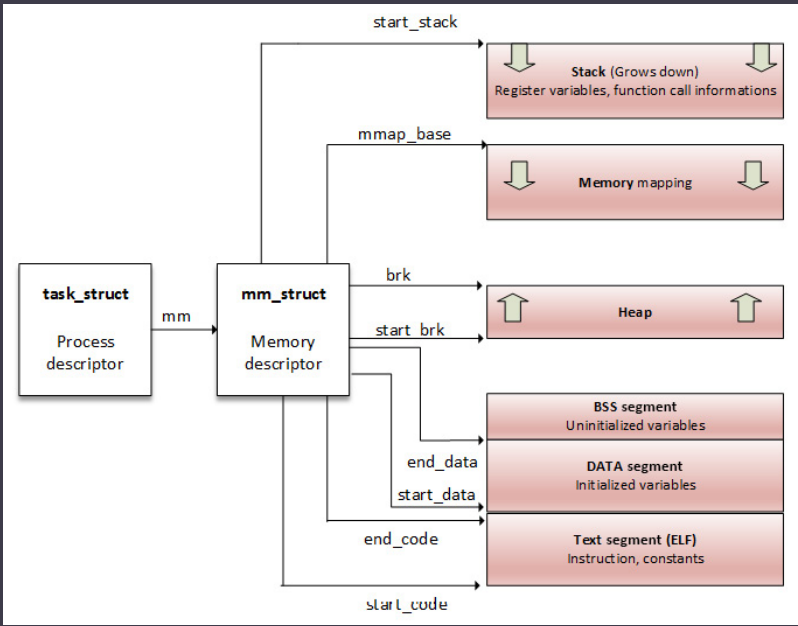
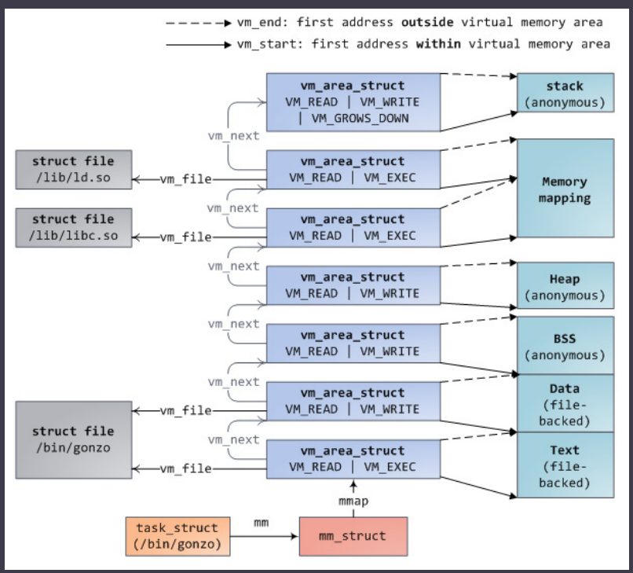
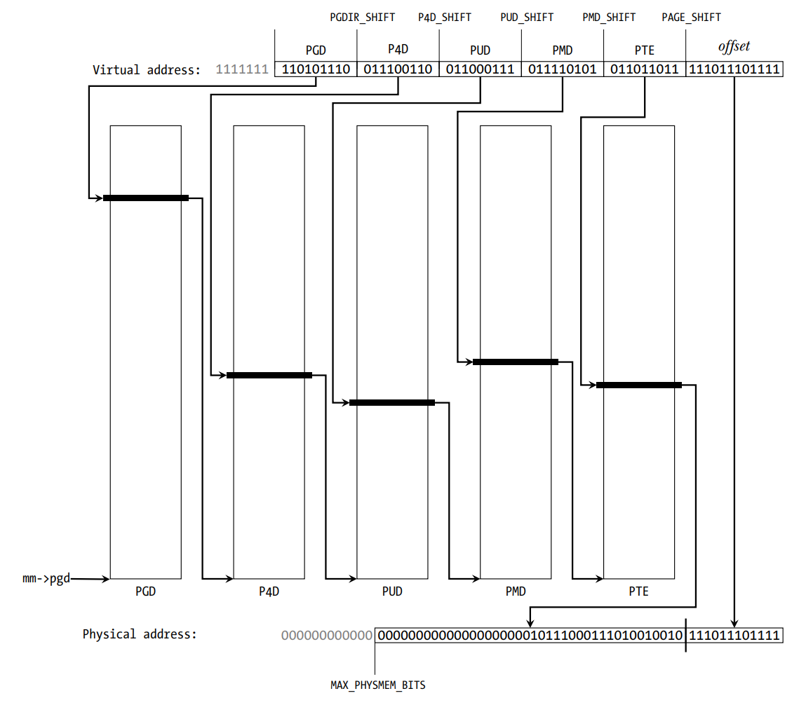
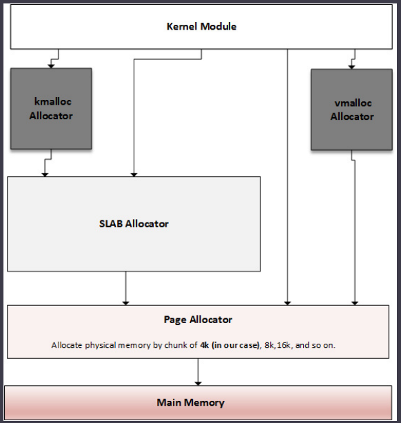

# Chap 10: Understanding the Linux Kernel Memory Allocation

* A `Logical Address` is an address resulting from a linear mapping.
    * It results from mapping above `PAGE_OFFSET`.
    * Such addresses are virtual addresses with a fixed offset from their physical addresses.
* A `Address space` is the amount of mem allocated for all possible addresses for a computational entity (eg CPU).
    * Can be physical or virtual.
* `MMU` organizes mem into logical units: `pages` -> `struct page`.
    * A `page` is backed by a page frame, and `sizeof(page) = sizeof(page frame)`.
* `page size` is fixed by MMU and OS can't modify it.
    * Some processors allow for multiple pages sizes eg ARMv8-A, and OS can can decide which to use.
---
QA
1. So there are as many page frames as there are pages in virtual address space ?
1. Are all these virtual address pages created when a process is executed ?
1. What happens if there is no page frame for a page in virtual address space ? How it is handled ?
---
* `PAGE FRAME NUMBER (PFN)`: each page frame is given a number.
* `Page Table`: kernel & architecture ds to store mappings between virtual and physical addresses.
* `Page-Aligned`: An address that starts exactly at the beginning of a page.
---
QA
1. How to ensure a page is aligned ? Or any size say 8 how can we always be 8 aligned?

Next Boundary
$$\text{Aligned Address} = (\text{addr} + P - 1) \mathbin{\&} \sim(P - 1)$$

$$\text{Is Aligned} = (\text{addr} \mathbin{\&} (P - 1)) == 0$$

Previous Boundary
$$\text{Aligned Address} = \text{addr} \mathbin{\&} \sim(P - 1)$$
---
* Neither kernel nor the processes deal with physical addresses only the `MMU` does.
* VAS is divided into `kernel(Upper VAS)` and `user space(lower VAS)`.
    * Split is held by `CONFIG_PAGE_OFFSET` config option.
    * for 32-bit sys: `0xC0000000`.
    * Kernel can however be given diff amount address space using `CONFIG_VMSPLIT_1G`,`CONFIG_VMSPLIT_2G` and `CONFIG_VMSPLIT_3G_OPT`.
    * for 64-bit high enough: `0x8000000000000000` for arm 64 bit and `0xfff880000000000` for x86_64.

### Concept of LOW and High Mem
* Ideally all mem is permanently mappable, some restriction being on 32 bit systems.
* `LOW MEM`: Portion of `RAM` permanently mapped, and this can directly accessible by the kernel.
* `HIGH MEM`: Not covered by permanent mapping.
* eg: `Intel` cores can permanently map only up to the first `1GB` of RAM. This is little less, 896 MIB of RAM, coz the low mem is used to dynamically map high mem.

    

* Here 128MB is used to map high mem of RAM on the fly when needed.
* More than one mapping to a RAM page frame can exits; it can both permanently mapped to the kernel mem space and mapped to some addr in the user space when the process is chosen for execution.
---
QA

1. Is the 128 MB kept empty and mapped only on demand ?
1. Why is the 128 MB window needed ?
1. When is this more than one mapping to single page frame used or useful ?
---

### Low mem
* kernel permanently maps that 896 MB onto physical RAM during the early boot process.
* Addresses of this region -> `logical Addr`.
* Core of the kernel stays in low mem.
* To serve diff purposes, kernel mem is divided into `zones`.
    * `ZONE_DMA`: contains page frames of mem below 16MB, reserved for DMA
    * `ZONE_NORMAL`: above 16MB and below 896MB for normal use.
    * `ZONE_HIGHMEM`: above 896MB
* `_va(address)` -> physical to logical.
* `_pa(address)` -> logical to physical.
* In 64-bit system full physical ram is mapped into kernel due to huge address range.

### High mem
* Used by kernel to temporarily map physical mem above 1GB.
* Its mapped on demand to the 128GB of the `HIGHMEM` region.
* Concept of high mem doesn't exist on 64-bit systems, due to the huge address range (264 TB).

### Process Address Space
* Each process is represented in the kernel as an instance of `struct task_struct`
* before process starts running, it is allocated a table of memory mapping, stored in a var of `struct mm_struct` type.
* In kernel there is a global var `current` and the `current->mm` field points to current process and current mem-mapping table.

    ```c

    struct task_struct{
        […]
        struct mm_struct *mm, *active_mm;
        […]
    }

    struct mm_struct {
        struct vm_area_struct *mmap; // upto kernel <=5.10
        
        // struct maple_tree mm_mt; in kernel > 5.10

        unsigned long mmap_base;
        unsigned long task_size;
        unsigned long highest_vm_end;
        pgd_t * pgd;
        atomic_t mm_users;
        atomic_t mm_count;
        atomic_long_t nr_ptes;
        #if CONFIG_PGTABLE_LEVELS > 2
        atomic_long_t nr_pmds;
        #endif
        int map_count;
        spinlock_t page_table_lock;
        unsigned long total_vm;
        unsigned long locked_vm;
        unsigned long pinned_vm;
        unsigned long data_vm;
        unsigned long exec_vm;
        unsigned long stack_vm;
        unsigned long start_code, end_code, start_data,
        end_data;
        unsigned long start_brk, brk, start_stack;
        unsigned long arg_start, arg_end, env_start, env_end;
        /* ref to file /proc/<pid>/exe symlink points to */
        struct file __rcu *exe_file;
    };
    ```

QA: Why required ?

* `struct mm_struct` has fields like:
    * `pgd` : ptr to process'base level one table(page global dir), written in the translation table base address of the CPU at context switching.



*  `Virtual Memory Area`: Consecutive virtual address range (set of page table entries).
    * Each mapping has `start address`, `length` and `permissions` and associated resources(physical pages, swap pages and file contents).
    * VMAs are stored in mapple tree.

### VMA
* The code section, each mapped file region (a library, for example), or each distinct memory mapping (if any) is materialized by a `VMA`.
* A Architecture-independent structure (`struct vma_area`), with permissions and access control flags, defined by a start address and a length.
* Sizes -> multiple of `PAGE_SIZE`.
* A VMA consists of few pages, each of which has an `PTE`.
```c
struct vm_area_struct {
    unsigned long vm_start;
    unsigned long vm_end;

    struct vm_area_struct *vm_next, *vm_prev;
    struct mm_struct *vm_mm;
    
    pgprot_t vm_page_prot;
    
    unsigned long vm_flags;
    unsigned long vm_pgoff;
    struct file * vm_file;
    [...]
}
```
* `vm_start` : start address withing address space (`vm_mm`).
* `vm_end` : First address outside this VMA i.e next byte after `vm_mm` end.
* `vm_next` and `vm_prev` : linked list for VM areas. (Removed in latest kernel > 5.10)
* `vm_mm` : The address space we belong to.
* `vm_page_prot` and `vm_flags`: Access permissions of this VMA;
* `vm_file`: File we map to (can be NULL eg process's heap or stack).
* `vm_pgoff`: Offset (within vm_file) in PAGE_SIZE units.

* In kernel > 5.10, `struct maple_tree mm_mt;` points to this vma areas organized as mapple tree. below it for linked list for kernel <= 5.10



* `find_vma(mm, addr)` returns the first VMA whose vm_end is greater than addr.
    * If addr is inside a VMA, it returns that VMA.
    * If addr lies in an unmapped gap, it returns the next VMA after the gap.
    * It returns `NULL` when no VMA exists at or above addr.
    ```c
    struct vm_area_struct *find_vma(struct mm_struct *mm,
                                    unsigned long addr);
    // example
    struct vm_area_struct *vma =
    find_vma(task->mm, 0x603000);

    if (vma == NULL) /* Not found ? */
        return -EFAULT;

    /* Beyond the end of returned VMA ? */
    if (0x13000 >= vma->vm_end)
        return -EFAULT;

    ```
* the whole memory mappings of a process can be obtained by reading the `/proc/<PID>/maps`, `/proc/<PID>/smaps`, and `/proc/<PID>/pagemap` files.
* output:  `{address (start-end)} {permissions} {offset} {device (major:minor)} {inode} {pathname (image)}`
eg 
```bash
# cat /proc/1073/maps
00400000-00403000 r-xp 00000000 b3:04 6438 /usr/sbin/net-listener
00602000-00603000 rw-p 00002000 b3:04 6438 /usr/sbin/net-listener
```
* `address`: start and end of VMA.
* `permissions`: `p`: mapping is private; `s`: shared mapping.
* `offset`: if file mapped offset in that file.
* `major:minor`: if file mapped, major minor of the devices in which the file is stored.
* `inode`: if file mapped, inode of the file.
* `pathname`: mapped file path, blank otherwise.

* There are other region names, such as `[heap]`, `[stack]`, or `[vdso]` (which stands for virtual dynamic shared object, a shared library mapped by the kernel into every process's address space, in order to reduce performance penalties when system calls switch to kernel mode).

* Each page allocated to a process belongs to an area, thus any page that does not live in the VMA does not exist and cannot be referenced by the process.

* `__GFP_HIGHMEM` and `GFP_HIGHUSER` are the flags for requesting the allocation of (potentially) high memory. Without these flags, all kernel allocations
return only low memory.
    * High mem is prefered for userspace coz its address space must be explicitly mapped.
* There is no way to allocate contiguous physical memory from user space in Linux.

### Address Translation and MMU
* `MMU` not only converts VAS to PA but also protects mem from unauthorized access.
* Any pages that needs to be accessed has to be present in one of it `VMAs`, and thus needs to live in process's page table.

QA: where is this page table located ? Who creates it? How it is stored and how it is accessed? How are page tables organised as a process can have multiple PTs ?

* `VMA`s are composed of two parts: a page number and a offset (logical address).
    * In 32 bit offset -> 12 LSB of the addr.
    * 13 bit on 8kb page-size system.
* PTE contains PFN. Offset is used to locate the right location in the page frame.
* PTE also contains accesses control info.
* `PAGE_SHIFT` kernel macro -> #bits used to represent the offset.
    * `PAGE_SHIFT` is no of times needed to left-shit 1 bit to obtain the `PAGE_SIZE` value. 
    * Its also #right shift needed to find page number, same for physical addr.
    * Architecture dependent.
* In multilevel page table, each table in level `N` will point to an entry in the table of level `N+1`, level 1 being the higher level.
* Each entry points to the base address of the appropriate next level page table.

* Linux can support levels of paging:
    1. `Page Global Directory (PGD)`
        * 1st level page table.
        * each entry -> `pgd_t` type, points to entry in the table at the second level.
        * `struct mm_struct` has `pgd` which points to the first entry of the process's level-1 (PGD) page table.
        * Each process has one and only one `PGD` which may contain 1024 entries.
    1. `Page Upper Directory (PUD)`
        * Second level of indirection
    1. `Page Middle Directory (PMD)`
        * Third level
    1. `Page Table Entry (PTE)`
        * An array of `pte_t` where each entry point to a physical page.
    


* MMU does not store any mapping, it is a Data Structure located in RAM.
* `Page Table Base Register (PTBR)` or the `Translation Table Base Register 0 (TTBR0)` which points to the base (entry 0) of the level-1 page table(PGD) of the process.
* `current->mm.pgd == TTBR0`.
* During context switch, the kernel immediately configures MMU and updates the `PTBR` with the new process's `PGD`.

Note:
* A four-level page table would require four mem accesses.
* in other words every virtual access would result in five physical mem accesses.
* Virtual mem concept would be useless if its access were four times slower than physical access.
* Modern CPUs use a small associative and very fast mem called `Translation Lookaside Buffer (TLB)` in order to cache the PTEs of recently accessed virtual pages.

### Page Lookup and TLB
* it is a `Content Addressable Memory (CAM)`
    * key: VA
    * value: PA
* Cache for MMU
* On TLB miss, two possibilities.
    1. `Software Handling`
        * CPU raises TLB miss interrupt, caught by OS
        * OS walks through the process's PT to find the right PTE.
        * If exits then CPU installs the new translation in the TLB.
        * Otherwise page fault handler is executed (`do_page_fault()`)
    1. `Hardware Handling`:
        * MMU has to walk through the PT.
        * If miss then CPU raises a page fault interrupt, handled by OS (`do_page_fault()`)
* On ARM, the location of the translation table must be written in `control` coprocessor 15 (CP15) `c2` register, and then enable the caches and MMU by writing to CP15 `c1` register.

## Kernel Memory Allocators


* `page allocator`: The main and lowest level allocator.
    * `vmalloc` relies on this
* `slab allocator`: build on top of `page allocator`, getting pages from it and splitting them into smaller mem entities (by means of slab and caches).
    * `kmalloc` relies on this allocator.
* We can directly talk to the slab to request mem from its caches or even build our own caches.


### The Page Allocator

* Brings page and page frame into the picture.
    * Physical mem is organized into fixed-size blocks: page frame.
    * While Virtual mem is organized into fixed-size blocks: pages.
    * Page Size == Frame Size.
* At this level `Page` is the lowest-level unit of memory that OS will give to any mem request at a low level.
* Lowest-level allocator, it allocates and deallocates blocks pages using the `buddy algo`.

APIS:
* Pages are allocated in blocks -> Power of 2 in size.
* Pages returned from this allocation are physically contiguous.
* `alloc_pages()` main api.

    ```c
    struct page *alloc_pages(gfp_t mask, unsigned int order)
    ```
* return `NULL` when no page can be allocated, otherwise it allocates 2<sup>order</sup> pages and returns ptr to an instance of `struct page`, which points to the first page of the reserved block.
* For single page API: `alloc_page`
    ```c
    #define alloc_page(gfp_mask) alloc_pages(gfp_mask, 0)
    ```
* `__free_pages()` must be used to release memory pages allocated with the
`alloc_pages()` function.
    ```c
    void __free_pages(struct page *page, unsigned int order);
    // takes first page of the allocated block
    ```
* `__get_free_pages()` and `__get_free_page()` to get (logical) addr of the reserved block.
    ```c
    unsigned long __get_free_pages(gfp_t mask, unsigned int order);
    unsigned long __get_free_page(gfp_t gfp_mask);
    // unsigned long get_zeroed_page(gfp_t mask);
    ```
* `free_pages` is to free a page allocation for `__get_free_pages()`
    ```c
    free_pages(unsigned long addr, unsigned int order);
    ```
* `mask` specifies the `mem zones` from where the pages should be allocated and the behavior of the allocators.
    1. `GFP_USER`: For user memory allocation.
    1. `GFP_KERNEL`: The commonly used flag for kernel allocation.
    1. `GFP_HIGHMEM`: This requests memory from the HIGH_MEM zone.
    1. `GFP_ATOMIC`: This allocates memory in an atomic manner that cannot sleep. It is used when we need to allocate memory from an interrupt context.

Note: 
> * `GFP_HIGHMEM` flag with `__get_free_pages()` (or `__get_free_page()`) or not, it won't be considered.  
> * This flag is masked out in these functions to make sure that the returned address never represents high-memory pages (because of their nonlinear/permanent mapping). If you need high memory, use `alloc_pages()` and then `kmap()` to access it.
> * The max order that can be used varies between architectures, depends on `FORCE_MAX_ZONEORDER` config flag, `11` by default.

* `page_to_virt()` function is used to convert a struct page (as returned by `alloc_pages()`, for example) into a kernel logical address.
* `virt_to_page()` takes a kernel logical address and returns its associated `struct page` instance (as if it was allocated using the `alloc_pages()` function).
    ```c
    struct page *virt_to_page(void *kaddr);
    void *page_to_virt(struct page *pg)

    // wraps page_to_virt() and returns
    // the logical address of the page passed; why needed ?
    void *page_address(const struct page *page)
    ```

### Slab Allocator
* Main purpose are to eliminate fragmentation caused by mem (de)allocation, which is caused by buddy system in case of small-size mem allocation and to speed up mem allocation for commonly used objects. 